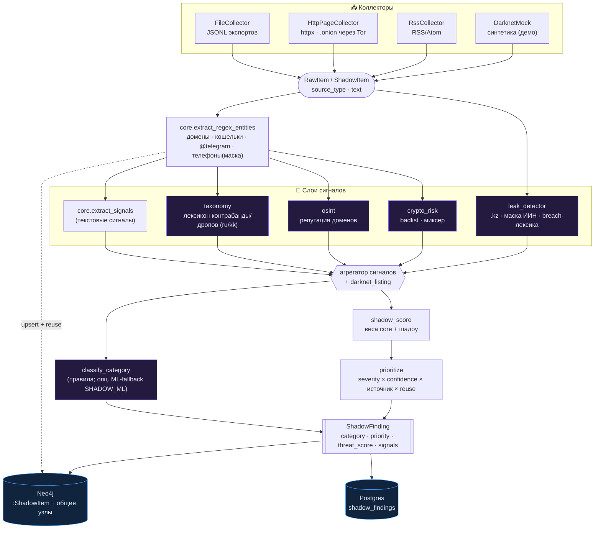
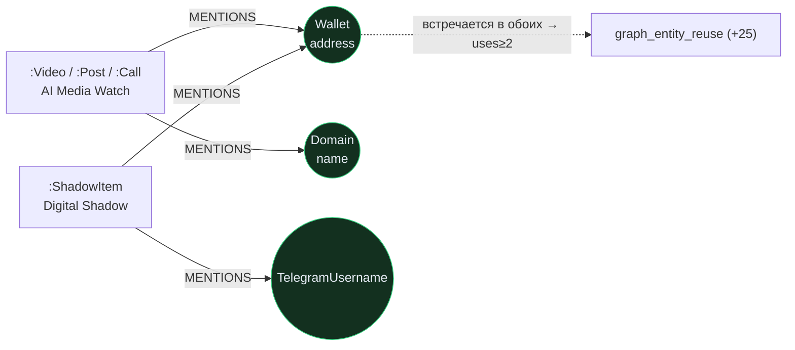
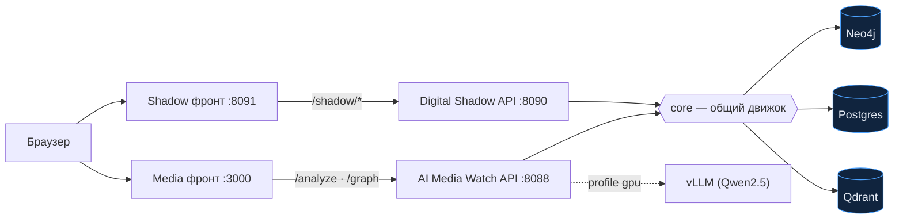

# Digital Shadow — архитектура модуля

OSINT/DarkNet-мониторинг признаков незаконной деятельности и оценка рисков: контрабанда
(вейпы/алкоголь/наркотики), вербовка дропов, подозрительные криптокошельки, утечки баз РК.
Сбор → извлечение сущностей → риск-сигналы → скоринг и приоритизация → граф скрытых связей.

Digital Shadow — **второй продукт на общем движке `core`** (первый — AI Media Watch). Оба
переиспользуют единый risk-engine, извлечение сущностей, Qdrant, Postgres и **один Neo4j**,
за счёт чего находки связываются между продуктами.

---

## 1. Сквозной пайплайн



---

## 2. Компоненты (соответствие коду)

| Слой | Модуль | Что делает |
|---|---|---|
| Коллекторы | `collectors/{file_collector,http_page,rss,darknet_mock}.py` | источник → `RawItem`; Tor через `--proxy` |
| CLI сбора | `collect.py` | коллектор → пайплайн → граф+БД → топ угроз |
| Оркестратор | `pipeline.py` `analyze_item()` | сущности → сигналы → категория → скоринг → находка |
| Таксономия | `taxonomy.py` | категории + лексикон (ru/kk) + шадоу-сигналы и веса |
| Крипто-риск | `crypto_risk.py` | тип кошелька, badlist, признаки миксера |
| Детект утечек | `leak_detector.py` | `kz_data_leak`, `iin_dump_mention`; маскирование ИИН |
| Приоритизация | `prioritization.py` | `shadow_score` (+шадоу-веса) и `prioritize` (threat) |
| Классификатор | `train_classifier.py` / `classifier.py` | TF-IDF+LogReg категорий (опц. fallback к правилам) |
| Персистентность | `persistence.py` → `shadow_findings` | сохранение/листинг находок (Postgres) |
| API | `app.py` (`/shadow/*`) | автономный FastAPI на :8090 (Neo4j+Postgres в lifespan) |
| Фронт | `frontend/index.html` | консоль: анализ · сбор · находки · граф (:8091) |
| Данные | `seed_data.py` · `gen_llm.py` · `run_batch.py` | seed · LLM-генерация · eval |
| Общий движок | `core` | сущности · risk_engine · graph · Qdrant · Postgres-клиенты |

---

## 3. Таксономия и сигналы

**Категории** (`SHADOW_CATEGORIES`): `contraband_vape`, `contraband_alcohol`, `drug_trafficking`,
`drop_recruitment`, `suspicious_crypto`, `kz_data_leak`, `counterfeit_goods`, `document_forgery`, `unknown`.

**Шадоу-сигналы** (поверх `core.RISK_SIGNALS`, веса в `taxonomy.SHADOW_SIGNAL_WEIGHTS`):
`darknet_listing`(25), `contraband_keyword`(25), `drug_slang`(35), `drop_recruitment`(35),
`kz_data_leak`(40), `iin_dump_mention`(45), `bad_crypto_wallet`(40), `mixer_or_tumbler`(30),
`crypto_only_payment`(15), `encrypted_contact`(15), `bulk_sale`(15), `no_kyc`(15) и др.

Лексикон матчится с **левой границей слова** `(?<!\w)` — чтобы «клад» не ловился в «оклад»,
а легальная розничная продажа («продам вейп, чек и гарантия») не попадала в контрабанду
(требуются контекстные маркеры «оптом»/«без акциз»).

---

## 4. Скоринг и приоритизация

```
risk_score = min(100, Σ weight(signal))           # веса: шадоу-веса > core-веса
risk_level = low / medium / high / critical        # пороги §11 (core)
threat     = min(100, risk × confidence × source) + reuse_bonus
confidence = 1.0 + 0.05·(уник. сигналов − 1)       # до ×1.2
source     = darknet 1.0 · paste/leak 0.9–1.0 · clearweb 0.75
priority   = low / medium / high / urgent
```
Приоритизация различает источники: один и тот же набор сигналов из даркнета весит больше, чем из clearweb.

---

## 5. Общий граф — мост между продуктами (главная ценность)

Оба продукта пишут через `core.graph_service.upsert_entities(..., source_label=...)` в **один Neo4j**.
Источники различаются лейблом, **сущности — общие узлы**, поэтому кошелёк/домен/`@ник` из
TikTok-скама (Media) и из даркнет-листинга (Shadow) сходятся в один узел.



`entity_reuse(value)` считает повторяемость по `name | code | address` среди источников любого
типа → сигнал `graph_entity_reuse`. Контракт схемы — [`shadow_graph_schema.md`](shadow_graph_schema.md).

Кросс-продуктовый запрос («сущность всплывает и в контенте, и в теневых источниках»):
```cypher
MATCH (e)<-[:MENTIONS]-(s)
WITH e, collect(DISTINCT labels(s)[0]) AS kinds, count(DISTINCT s) AS uses
WHERE 'ShadowItem' IN kinds AND any(k IN ['Video','Post','Call'] WHERE k IN kinds)
RETURN coalesce(e.name,e.code,e.address) AS entity, kinds, uses ORDER BY uses DESC;
```

---

## 6. Персистентность

Таблица **`shadow_findings`** (Alembic `0003`): `category, priority, threat_score, risk_level,
source_type, signals, entities, wallet_risks, …`. Отдельная от `analysis_sessions` (у Shadow
своя таксономия). Эндпоинты `/shadow/sessions?category=&priority=`. Best-effort: сбой БД не валит анализ.

---

## 7. Данные и ML

- **seed** (`seed_data.py`) — 55 размеченных синтетических кейсов (ручной шаблон).
- **LLM-генерация** (`gen_llm.py`) — vLLM пишет листинги, каждый **самопроверяется** прогоном через
  пайплайн → в файл только корректно классифицированные. 271 валидных при `SCALE=1.0`.
- **eval** (`run_batch.py`) — сверка `category`/`signals` с `gold_*`. Объединённый датасет 326 строк → 100%.
- **классификатор** (`train_classifier.py`) — TF-IDF(слова+символы)+LogReg, **macro-F1 ≈ 0.98** на hold-out;
  опциональный fallback к правилам при `unknown` (`SHADOW_ML=1`).

---

## 8. Развёртывание



Два независимых сервиса, один общий слой данных. Контракт `core` защищён тестами + CI
(`tests/test_core_contract.py`, `.github/workflows/ci.yml`) — PR одной команды, ломающий core,
валит сборку второй.

---

## 9. Эндпоинты и команды

| Эндпоинт | Назначение |
|---|---|
| `POST /shadow/analyze` | анализ элемента → ShadowFinding (+граф +БД +watchlist) |
| `POST /shadow/collect/mock` | синтетические листинги → находки (демо) |
| `GET /shadow/queue` | очередь триажа по threat (фильтр `status`) |
| `POST /shadow/findings/{id}/review` | решение аналитика (confirm/dismiss/in_review) |
| `GET·POST·DELETE /shadow/watchlist` | отслеживаемые сущности → сигнал `watchlisted` |
| `GET /shadow/actors` · `GET /shadow/cross` | топ повторяющихся сущностей · кросс-продуктовые |
| `GET /shadow/clusters` | кластеры связанных акторов (связные компоненты по со-упоминанию) |
| `GET /shadow/graph` | теневой граф (общий Neo4j) |
| `GET /shadow/sessions` | находки из Postgres (фильтры category/priority) |
| `GET /shadow/health` | статус (граф/БД) |

**Триаж (human-in-the-loop):** находка имеет `status` (`new → in_review → confirmed/dismissed`),
таблица `shadow_reviews` хранит решения; очередь сортируется по `threat_score`.
**Watchlist:** `shadow_watchlist` (кошельки/домены/@ник); совпадение в находке → сигнал
`watchlisted` (+30) и рост приоритета. **Акторы:** агрегация графа — топ сущностей по повторяемости,
с флагом `cross_product` (мост Media↔Shadow). **Кластеры** (`/shadow/clusters`): связные
компоненты по со-упоминанию (union-find над двудольными рёбрами «сущность ← источник») —
видна структура сети, кросс-продуктовые кластеры наверху. Все ключи сущностей канонизируются
(`core.normalize_entity_value`, см. [shadow_graph_schema.md](shadow_graph_schema.md)), чтобы одна
сущность из Media и Shadow была одним узлом. Фронт `:8091` — вкладки Очередь · Watchlist · Акторы.

```bash
docker compose -f infra/docker-compose.yml up -d qdrant neo4j postgres
make shadow            # API :8090       make shadow-front   # UI :8091
make shadow-seed       # seed-датасет    make shadow-gen     # LLM-генерация (нужен vLLM)
make shadow-eval       # метрики         make shadow-train   # ML-классификатор
make shadow-collect ARGS="--file data/shadow/inbox.jsonl"   # боевой сбор → граф+БД
```

---

## 10. Безопасность (§0)
Только публичные источники; без контактов/покупок; реальные ПДн из утечек/дампов **не сохраняем**
(маски/хэши); наркотики/реальный даркнет — синтетика/research, не краулинг. Система выявляет
риск-сигналы и передаёт на ручную проверку аналитика — **не выносит обвинение**.

Сопутствующее: [two_products.md](two_products.md) · [shadow_graph_schema.md](shadow_graph_schema.md) ·
[digital_shadow_data_task.md](digital_shadow_data_task.md) · презентация `presentation/digital_shadow.html`.
