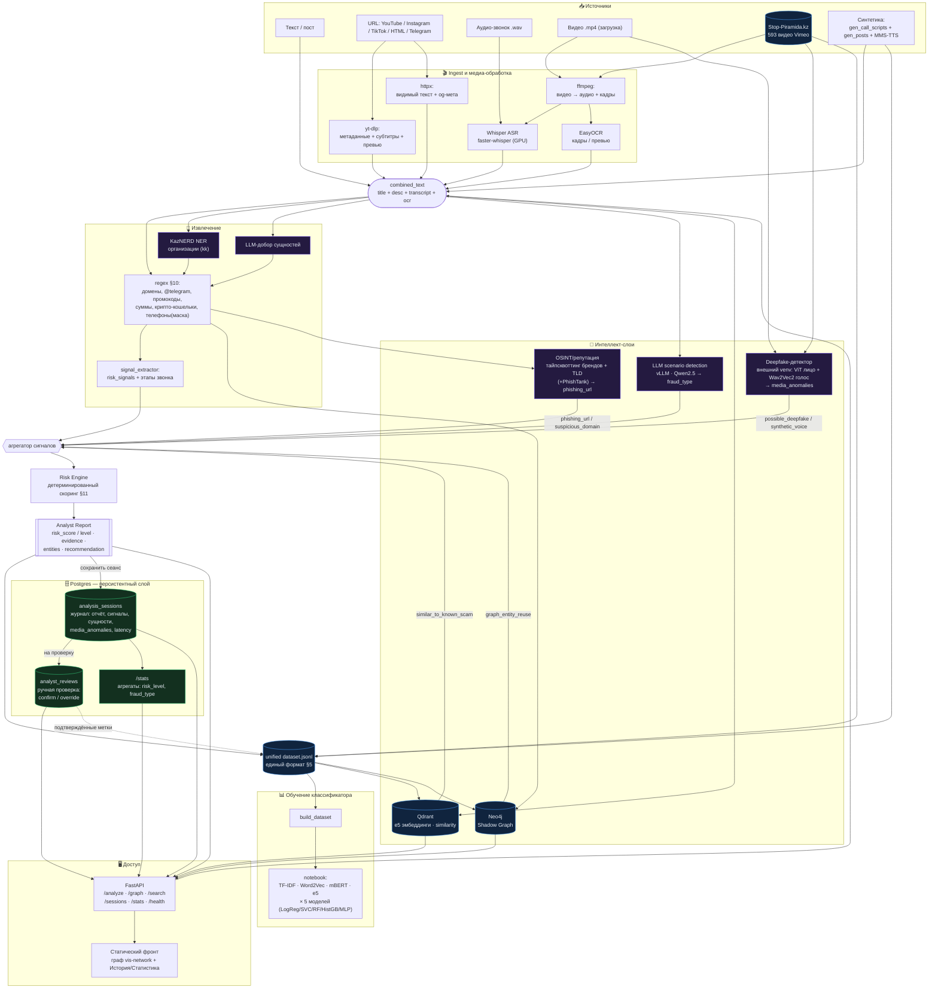

# FakeFace FinGuard — полный пайплайн

## Слои (соответствие коду)

| Слой | Модуль | Что делает |
|---|---|---|
| Ingest по ссылке | `src/ingest/url_fetcher.py` | yt-dlp (видео-платформы) + httpx (HTML/Telegram) + OCR превью |
| Медиа | `backend/app/services/media.py`, `src/media/{asr_whisper,ocr}.py` | ffmpeg → Whisper ASR + EasyOCR |
| Извлечение сущностей | `src/extraction/regex_extractors.py`, `kaznerd_ner.py` | regex §10 + KazNERD (kk) + LLM-добор |
| Сигналы | `src/extraction/signal_extractor.py` | risk_signals + этапы звонка |
| Scenario / LLM | `backend/app/services/scenario.py` → vLLM | fraud_type §7 |
| Deepfake-детектор | `backend/app/services/deepfake.py` → `external/fakeface-detector` (свой venv) | `media_anomalies` (ViT лицо + Wav2Vec2 голос) → `possible_deepfake`/`synthetic_voice_suspected` |
| OSINT/репутация | `backend/app/services/osint.py` | тайпсквоттинг KZ-брендов + TLD (+PhishTank) → `phishing_url`/`suspicious_domain` |
| Similarity | `backend/app/services/similarity.py` → Qdrant | similar_to_known_scam |
| Shadow Graph | `backend/app/services/graph.py` → Neo4j | graph_entity_reuse, повторяемость |
| Risk Engine | `src/risk/risk_engine.py` | детерминированный скоринг §11 → Analyst Report |
| Оркестратор | `backend/app/services/pipeline.py` | связывает всё в `/analyze/*` |
| Персистентность | `backend/app/db/`, `services/sessions.py`, Alembic | сеансы анализа + ручная проверка (Postgres) → `/sessions` `/stats` |
| Датасет / обучение | `src/build_dataset.py`, `notebooks/fraud_classifier.ipynb` | единый JSONL → 4 представления × 5 моделей |
| Доступ | `backend/app/api/*`, `frontend/index.html` | REST + фронт с граф-визуализацией |
